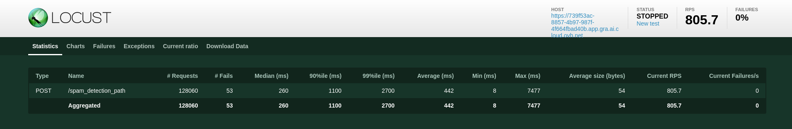
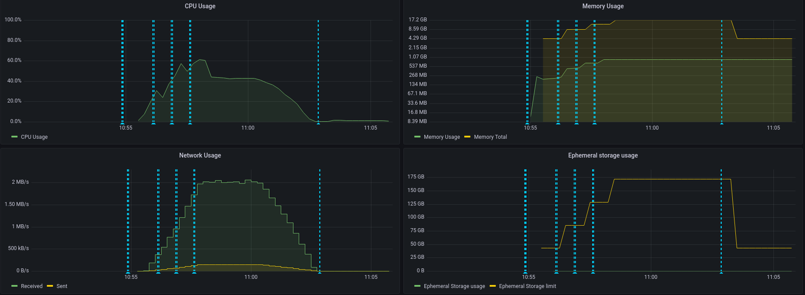
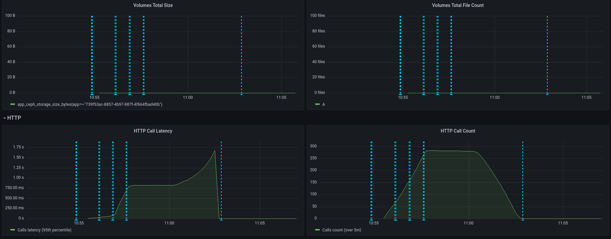
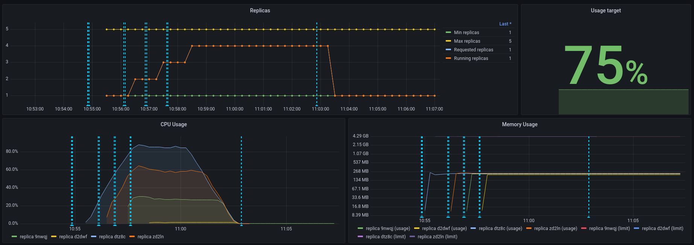

**Last updated 7th March, 2023.**

## Objective

The aim of this tutorial is to benchmarking your application. Imagine you create your application and you want to know how many GPU you will need to deploy it. How many users will use your API ? To do this, there are several applications who simulate the number of users and the number of requests you want to simulate. But let's dive a little deeper. We will use here a simple framework from python named locust. This framework is really easy to install if you have pip on your machine. Of course, there lots of others applications to stress test your apps. I can name [hey](https://github.com/rakyll/hey). This app requires to use a virtual machine so is a little more complicated to install compared to locust. You can also use [k6](https://k6.io/docs/test-types/stress-testing/). This framework is a little more complicated to install but can be use without python if you don't like the language. Lots of apps have been created to stress test your applications. Now, let's try to test our API. In this use case, the api is a spam classifier. If you're interested with this API, please check this [tutorial](https://docs.ovh.com/fr/publiccloud/ai/deploy/tuto-fastapi-spam-classifier/). Lots of others API are available on the `OVH portfolio` from AI deploy. You can found them [here](https://docs.ovh.com/fr/publiccloud/ai/deploy/apps-portfolio/). But it is not the purpose of the tutorial because you must test your API ! 

**Requirements**

- Access to the [OVHcloud Control Panel](https://www.ovh.com/auth/?action=gotomanager&from=https://www.ovh.co.uk/&ovhSubsidiary=GB);
- A Public Cloud project created;
- An API running in AI Deploy on your public cloud project. 

## Instructions


### Try our API

Ok let's test our API with a simple curl command. To do this, we will do a simple curl command in a terminal. Here is the command : 
```console 
curl -s -X POST \ 
"<api_url>/spam_detection_path \
-H "Authorization: Bearer <token>" \
-H "Content-Type: application/json" \
-d '{"message":"This is a test from my machine"}' | jq
```

Here are a few explanations of the lines : 
- In the first line, we specify that we will use a post method. 
- We specify the url where the post request will be executed. The `api_url` is the url of your api. It should look something like this : `https://baac2c13-2e69-4d0f-ae6b-dg9eff9be513.app.gra.ai.cloud.ovh.net/`. 
- We put the token to access our API. We specify it in the header of the request. 
- We specify that our body in in a json format.
- We put in our body the message we want to send to the spam classifier. In your case, the body could be different because it depends of the API. And we hope the chatbot will send us the probability of each response. The last `| jq` instruction permits to have a good display of the result in the terminal. 

Now, that we test our API, let's try to stress test it. We will simply simulate several curl command. With the tool locust, we can simulate several users and define a number of calls to the API we want per minute. This can be easily done with the locust's interface. But before use this interface, we need to launch the locust and configure the tool. This can be easily done with python. Let's do this !

### Configure Locust to run the tests

To configure the software, you need to create a file named `locustfile.py`. In this file, you can put the path where you want to make your request, the headers of your request, the type of the request (POST, GET, etc) and the body if you want to add a body to the request. For my API, the locust file will be something like this : 
```python
# Import the dependecies of locust
from locust import HttpUser, task
# Import general library from python
import os
import random
# Import lorem ipsum library to generate some text
from lorem_text import lorem
# Import dotenv to load the environments variables
from dotenv import load_dotenv
load_dotenv()

# Create a table with some lorem ipsum texts
messages = []

# Add 1000 random texts of 10 paragraphs each (simulate 1000 emails)
for i in range(1000):
    messages.append(lorem.paragraphs(10))

# Define the headers of the request
headers = {
    "Authorization": f"Bearer {os.getenv('TOKEN')}", "Content-Type": "application/json"}


class HelloWorldUser(HttpUser):
    # Definition of the first path where we do our post request
    @task
    def hello_world(self):
        # Define the body with the email choose randomly from the tab of all the emails
        body = {"message": random.choice(messages)}
        # Do the post request on the spam detection path
        self.client.post("/spam_detection_path",
                         headers=headers, json=body)
```

In this file, you have to change the path, the headers and the body because there are parameters who change from API to API. Once your locustfile is ready, you need to launch the interface locust. The best way to create this is to launch a container with your locust app. You can launch it locally with docker or directly on AI Deploy. [Here](https://docs.ovh.com/gb/en/publiccloud/ai/deploy/build-use-streamlit-image/) is an example of how to launch an app on AI Deploy. Below is how looks like your `requirements.txt` file if you want to use docker to launch locust. 
```
Brotli==1.0.9
certifi==2022.12.7
charset-normalizer==3.1.0
click==8.1.3
ConfigArgParse==1.5.3
Flask==2.2.3
Flask-BasicAuth==0.2.0
Flask-Cors==3.0.10
gevent==22.10.2
geventhttpclient==2.0.8
greenlet==2.0.2
idna==3.4
importlib-metadata==6.0.0
itsdangerous==2.1.2
Jinja2==3.1.2
locust==2.15.0
lorem-text==2.1
MarkupSafe==2.1.2
msgpack==1.0.4
psutil==5.9.4
python-dotenv==1.0.0
pyzmq==25.0.0
requests==2.28.2
roundrobin==0.0.4
six==1.16.0
typing_extensions==4.5.0
urllib3==1.26.14
Werkzeug==2.2.3
zipp==3.15.0
zope.event==4.6
zope.interface==5.5.2
```

And the dockerfile should be somethink like this : 
```
FROM python:3.8

WORKDIR /workspace
ADD . /workspace

RUN pip install --no-cache-dir -r requirements.txt


RUN chown -R 42420:42420 /workspace
ENV HOME=/workspace

EXPOSE 8089

CMD locust
```

Now, I have my app running on OVHcloud. Let's simulate some users ! 

You can go on the url of your locust app and you should see somethink like this : 
{.thumbnail}

Ok, now let's run our test to test our API. For my example, I will fill 1000 users of the API with 100 users who make a call per minute. And I will simulate this for a duration of 10m. Let's run and wait. Tic, Tac, the results will be in the next part ! 

### See the results with Locust

At the end of the test, I can get something like this in locust : 
{.thumbnail}

I can see the number of request I made, the number of fails and also the number of current failures per seconds. Here, I can see that this value is null. I use for this API 3 CPU and 3 replicas with auto-scaling. I can see that my API hasn't be surcharged. So if my simulation is correct and I attend to get this specific number of users, 3 cpu is enough for my API. We can of course make a new test with more users to see the limits of our apis. put several task in the `locustfile.py`. 

You can also see the details of the failure if you go on the tab failures. You can see if it is a server error or client or if the response has been to too long to be send. Some charts are also alavailable if you want to see when the failure has happened. All of your data can also be download in csv format if you want to see it after. 

Let's see the same results in detail with the OVHcloud Monitoring APP. 

### See the results with the OVHcloud Monitoring APP

This tool is provided for all of your applications in AI Deploy. All of the tools are combined in a simple Grafana Dashboard. You just have to change on the top of it the id of the app you want to monitor. With this tool, you can see the purcentage of cpu used in real time, the HTTP latency of your api, the auto scaling of the app. Here is the result for the CPU I get : 
{.thumbnail}

We can see that our application is not at the maximum capacity of CPU. You can change the test if you want. Let's take a look at the latency of our application. 
{.thumbnail}

Here we see that the latency has increased because 100 users made request in only one minute. Does I need to provide more GPU because the latency is too high ? No, I don't think so because we use a spam classifier and the latency is not the more important point. Let's now take a look at the scaling of our application. 
{.thumbnail}

We can see that the target has been fixed at 25% for the auto scaling and this has been respected. The app shows us what we must change for our api with the number of cpu/gpu. 

## Go further

If you want to use more functionnality about Rasa, please fill free to go into this link. We use Rasa Open Source and not Rasa X. 

[Rasa Open source](https://rasa.com/docs/rasa/)

If you want to deploy your model created with the chatbot, you can follow this tutorial. 

[How to deploy a chatbot](https://confluence.ovhcloud.tools/display/~victor.vitcheff@corp.ovh.com/Part+3+deploy+your+rasa+chatbot+with+a+simple+django+app)

If you want to train a rasa chatbot with the tool AI Training, please look at this tutorial .

[How to train a chatbot with only one docker file](https://confluence.ovhcloud.tools/display/~victor.vitcheff@corp.ovh.com/Part+2+Train+a+rasa+chatbot+with+one+docker+file)

## Feedback

Please send us your questions, feedback and suggestions to improve the service:

- On the OVHcloud [Discord server](https://discord.com/invite/vXVurFfwe9)